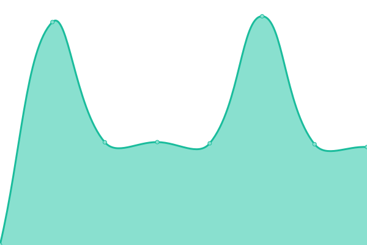
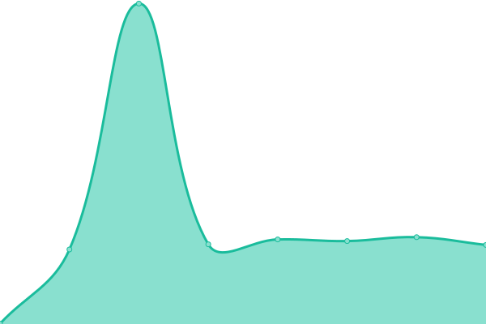

# [📈 Live Status](https://status.p1ass.com): <!--live status--> **🟧 Partial outage**

Upptime (https://upptime.js.org) is the open-source uptime monitor and status page, powered entirely by GitHub Actions and Issues.

[](https://github.com/p1ass/status/actions?query=workflow%3A%22Static+Site+CI%22)
[](https://github.com/p1ass/status/actions?query=workflow%3A%22Graphs+CI%22)
[](https://github.com/p1ass/status/actions?query=workflow%3A%22Response+Time+CI%22)
[](https://github.com/p1ass/status/actions?query=workflow%3A%22Summary+CI%22)
[](https://github.com/p1ass/status/actions?query=workflow%3A%22Uptime+CI%22)

<!--start: status pages-->
<!-- This summary is generated by Upptime (https://github.com/upptime/upptime) -->
<!-- Do not edit this manually, your changes will be overwritten -->
<!-- prettier-ignore -->
| URL | Status | History | Response Time | Uptime |
| --- | ------ | ------- | ------------- | ------ |
|  [p1ass.com](https://p1ass.com) | 🟥 Down | [p1ass-com.yml](https://github.com/p1ass/status/commits/HEAD/history/p1ass-com.yml) | <details><summary> 287ms</summary><br><a href="https://status.p1ass.com/history/p1ass-com"></a><br><a href="https://status.p1ass.com/history/p1ass-com"></a><br><a href="https://status.p1ass.com/history/p1ass-com"></a><br><a href="https://status.p1ass.com/history/p1ass-com"></a><br><a href="https://status.p1ass.com/history/p1ass-com"></a></details> | <details><summary><a href="https://status.p1ass.com/history/p1ass-com">100.00%</a></summary><a href="https://status.p1ass.com/history/p1ass-com"></a><br><a href="https://status.p1ass.com/history/p1ass-com"></a><br><a href="https://status.p1ass.com/history/p1ass-com"></a><br><a href="https://status.p1ass.com/history/p1ass-com"></a><br><a href="https://status.p1ass.com/history/p1ass-com"></a></details>
|  [blog.p1ass.com](https://blog.p1ass.com) | 🟩 Up | [blog-p1ass-com.yml](https://github.com/p1ass/status/commits/HEAD/history/blog-p1ass-com.yml) | <details><summary> 113ms</summary><br><a href="https://status.p1ass.com/history/blog-p1ass-com"></a><br><a href="https://status.p1ass.com/history/blog-p1ass-com"></a><br><a href="https://status.p1ass.com/history/blog-p1ass-com"></a><br><a href="https://status.p1ass.com/history/blog-p1ass-com"></a><br><a href="https://status.p1ass.com/history/blog-p1ass-com"></a></details> | <details><summary><a href="https://status.p1ass.com/history/blog-p1ass-com">100.00%</a></summary><a href="https://status.p1ass.com/history/blog-p1ass-com"></a><br><a href="https://status.p1ass.com/history/blog-p1ass-com"></a><br><a href="https://status.p1ass.com/history/blog-p1ass-com"></a><br><a href="https://status.p1ass.com/history/blog-p1ass-com"></a><br><a href="https://status.p1ass.com/history/blog-p1ass-com"></a></details>
|  [blog-api.p1ass.com](https://blog-api.p1ass.com/rss) | 🟩 Up | [blog-api-p1ass-com.yml](https://github.com/p1ass/status/commits/HEAD/history/blog-api-p1ass-com.yml) | <details><summary> 861ms</summary><br><a href="https://status.p1ass.com/history/blog-api-p1ass-com"></a><br><a href="https://status.p1ass.com/history/blog-api-p1ass-com"></a><br><a href="https://status.p1ass.com/history/blog-api-p1ass-com"></a><br><a href="https://status.p1ass.com/history/blog-api-p1ass-com"></a><br><a href="https://status.p1ass.com/history/blog-api-p1ass-com"></a></details> | <details><summary><a href="https://status.p1ass.com/history/blog-api-p1ass-com">100.00%</a></summary><a href="https://status.p1ass.com/history/blog-api-p1ass-com"></a><br><a href="https://status.p1ass.com/history/blog-api-p1ass-com"></a><br><a href="https://status.p1ass.com/history/blog-api-p1ass-com"></a><br><a href="https://status.p1ass.com/history/blog-api-p1ass-com"></a><br><a href="https://status.p1ass.com/history/blog-api-p1ass-com"></a></details>
|  [midare.p1ass.com](https://midare.p1ass.com) | 🟩 Up | [midare-p1ass-com.yml](https://github.com/p1ass/status/commits/HEAD/history/midare-p1ass-com.yml) | <details><summary> 142ms</summary><br><a href="https://status.p1ass.com/history/midare-p1ass-com"></a><br><a href="https://status.p1ass.com/history/midare-p1ass-com"></a><br><a href="https://status.p1ass.com/history/midare-p1ass-com"></a><br><a href="https://status.p1ass.com/history/midare-p1ass-com"></a><br><a href="https://status.p1ass.com/history/midare-p1ass-com"></a></details> | <details><summary><a href="https://status.p1ass.com/history/midare-p1ass-com">100.00%</a></summary><a href="https://status.p1ass.com/history/midare-p1ass-com"></a><br><a href="https://status.p1ass.com/history/midare-p1ass-com"></a><br><a href="https://status.p1ass.com/history/midare-p1ass-com"></a><br><a href="https://status.p1ass.com/history/midare-p1ass-com"></a><br><a href="https://status.p1ass.com/history/midare-p1ass-com"></a></details>
|  [midare-api.p1ass.com](https://midare-api.p1ass.com) | 🟩 Up | [midare-api-p1ass-com.yml](https://github.com/p1ass/status/commits/HEAD/history/midare-api-p1ass-com.yml) | <details><summary> 258ms</summary><br><a href="https://status.p1ass.com/history/midare-api-p1ass-com"></a><br><a href="https://status.p1ass.com/history/midare-api-p1ass-com"></a><br><a href="https://status.p1ass.com/history/midare-api-p1ass-com"></a><br><a href="https://status.p1ass.com/history/midare-api-p1ass-com"></a><br><a href="https://status.p1ass.com/history/midare-api-p1ass-com"></a></details> | <details><summary><a href="https://status.p1ass.com/history/midare-api-p1ass-com">100.00%</a></summary><a href="https://status.p1ass.com/history/midare-api-p1ass-com"></a><br><a href="https://status.p1ass.com/history/midare-api-p1ass-com"></a><br><a href="https://status.p1ass.com/history/midare-api-p1ass-com"></a><br><a href="https://status.p1ass.com/history/midare-api-p1ass-com"></a><br><a href="https://status.p1ass.com/history/midare-api-p1ass-com"></a></details>
|  [grafana.p1ass.com](https://grafana.p1ass.com/) | 🟥 Down | [grafana-p1ass-com.yml](https://github.com/p1ass/status/commits/HEAD/history/grafana-p1ass-com.yml) | <details><summary> 0ms</summary><br><a href="https://status.p1ass.com/history/grafana-p1ass-com"></a><br><a href="https://status.p1ass.com/history/grafana-p1ass-com"></a><br><a href="https://status.p1ass.com/history/grafana-p1ass-com"></a><br><a href="https://status.p1ass.com/history/grafana-p1ass-com"></a><br><a href="https://status.p1ass.com/history/grafana-p1ass-com"></a></details> | <details><summary><a href="https://status.p1ass.com/history/grafana-p1ass-com">100.00%</a></summary><a href="https://status.p1ass.com/history/grafana-p1ass-com"></a><br><a href="https://status.p1ass.com/history/grafana-p1ass-com"></a><br><a href="https://status.p1ass.com/history/grafana-p1ass-com"></a><br><a href="https://status.p1ass.com/history/grafana-p1ass-com"></a><br><a href="https://status.p1ass.com/history/grafana-p1ass-com"></a></details>

<!--end: status pages-->

## 👩‍💻 Getting started

1. Create a new repository [using this template](https://github.com/p1ass/status/generate)
2. Update the [`.upptimerc.yml`](./.upptimerc.yml) file with your configuration
3. Enable publishing the `gh-pages` branch for your status website and add a `GH_PAT`

### Concepts

#### Issues as incidents

When the GitHub Actions workflow detects that one of your URLs is down, it automatically opens a GitHub issue ([example issue #15](https://github.com/p1ass/status/issues/15)). You can add incident reports to this issue by adding comments. When your site comes back up, the issue will be closed automatically as well.

<table>
  <tr>
    <td>
      
    </td>
    <td>
      
    </td>
  </tr>
</table>

#### Commits for response time

Four times per day, another workflow runs and records the response time of your websites. This data is commited to GitHub, so it's available in the commit history of each file ([example commit history](https://github.com/p1ass/status/commits/master/history/wikipedia.yml)). Then, the GitHub API is used to graph the response time history of each endpoint and to track when a site went down.

<table>
  <tr>
    <td>
      
    </td>
    <td>
      
    </td>
  </tr>
</table>

### Configuration

- [Repository](#repository)
- [Endpoints](#endpoints)
- [User agent](#user-agent)
- [Notifications](#notifications)
- [Assignees](#assignees)
- [Branding](#branding)
- [Intro text](#intro-text)
- [Site deployment](#site-deployment)
- [Internationalization](#internationalization)

The [`.upptimerc.yml`](./.upptimerc.yml) file is used as the central configuration for Upptime, with this syntax:

```yaml
owner: koj-co # GitHub username
repo: upptime # GitHub repository name
user-agent: koj-co
sites: # List of endpoints to track
  - name: Google
    url: https://www.google.com
assignees: # Users to assign downtime issues (optional)
  - AnandChowdhary
status-website: # Status website (optional)
  cname: upptime.js.org # Custom domain CNAME
  name: Upptime # Status website title
```

#### Repository

A GitHub repository is used as the "source of truth" for your uptime logs, and the static site uses the GitHub API and fetches data from this repository.

After you've created a new repository using this template (see [Creating a repository from a template](https://docs.github.com/en/github/creating-cloning-and-archiving-repositories/creating-a-repository-from-a-template)), specify the username and repository name in the configuration:

```yaml
owner: koj-co
repo: upptime
```

#### Endpoints

You can track as many websites as you like. Add the names and URLs of your endpoints in the `sites` key:

```yaml
sites:
  - name: Google
    url: https://www.google.com
  - name: DuckDuckGo
    url: https://duckduckgo.com
```

To make `POST` requests (or any other HTTP verb), you can add the `method` key:

```yaml
sites:
  - name: POST to Google
    url: https://www.google.com
    method: POST
  - name: DELETE Example
    url: https://example.com
    method: DELETE
```

If you don't want to show a URL publicly, you can use repository secrets (see [Creating and storing encrypted secrets](https://docs.github.com/en/actions/configuring-and-managing-workflows/creating-and-storing-encrypted-secrets)). Instead of the plain text URL, add the name of the secret prefixed with a `$` character:

```yaml
- name: Secret Site
  url: $SECRET_SITE
```

In the above example, a secret named `SECRET_SITE` (without the `$`) is stored in the repository. Note that you'll also have to add this secret as an environment variable in each workflow file in [`.github/workflows`](./.github/workflows):

```yaml
# Example: .github/workflows/graphs.yml
# ...
- name: Run script
  run: npm run graphs
  env:
    SECRET_SITE: ${{ secrets.SECRET_SITE }} # Add your repository secret
```

#### User agent

Requests made to the GitHub API must include a valid `User-Agent` header (see [User Agent required](https://docs.github.com/en/rest/overview/resources-in-the-rest-api#user-agent-required)). It is recommended to use your GitHub username here:

```yaml
user-agent: your-github-username
```

#### Notifications

You can add services to send downtime notifications to. Currently, only Slack notifications are supported.

##### Slack

Use `slack` as the `type` and provide a Slack channel ID as `channel` in the configuration.

```yaml
notifications:
  - type: slack
    channel: C01XQ3U9M9P
```

A Slack App has to be registered and installed prior to usage, with the scope `chat:write` (see [chat.postMessage](https://api.slack.com/methods/chat.postMessage) docs), and the environment variable `SLACK_APP_ACCESS_TOKEN` should be set with the Slack Bot User OAuth Access Token. You can use GitHub Secrets to add it.

#### Assignees

You can add members of your team to be assigned to every downtime issue:

```yaml
assignees:
  - AnandChowdhary
  - CarloBadini
```

If you want particular users to be assigned per-site, you can add `assignees` under each entry in `sites`:

```yaml
sites:
  - name: Google
    url: https://www.google.com
    assignees:
      - AnandChowdhary
```

#### Branding

A static website with PWA is also generated, and you can customize the logo and name in the navbar:

```yaml
status-website:
  name: Upptime
  logoUrl: https://example.com/image.jpg
```

If you want to add a custom domain, you can add the `cname` key:

```yaml
status-website:
  name: Upptime
  logoUrl: https://example.com/image.jpg
  cname: upptime.js.org # Custom CNAME
```

#### Intro text

Optionally, you can add some introductory text to the website. You can use Markdown:

```yaml
status-website:
  introTitle: "**Upptime** is the open-source uptime monitor and status page, powered entirely by GitHub."
  introMessage: This is a sample status page which uses **real-time** data from our [Github repository](https://github.com/p1ass/status). No server required — just GitHub Actions, Issues, and Pages.
```

#### Site deployment

Because GitHub Pages does not support the default `GITHUB_TOKEN` available to workflows, you'll have to set a secret `GH_PAT` with a Personal Access Token. For more info, see: https://github.com/maxheld83/ghpages#secrets.

#### Internationalization

Though our status page is in English, you can use any language with Upptime by supplying the required strings. The list of all required strings is available in [`site/i18n.yml`](./site/i18n.yml), and you can add them under the `i18n` key in the configuration file:

```yaml
i18n:
  activeIncidents: Incidentes activos
  allSystemsOperational: Todos los sistemas están operativos
  # ...
```

### Updating

This template is updated from time to time, so you can use the [`update-template`](https://github.com/koj-co/update-template) command to sync the changes from this GitHub repository template:

```bash
npm run update-template
```

### Badges

You can use the [Shields.io](https://shields.io) service with the API endpoint generated by your repository's `api` directory. For example, the URL https://raw.githubusercontent.com/p1ass/status/master/api/google/uptime.json has the following JSON schema:

```json
{
  "schemaVersion": 1,
  "label": "uptime",
  "message": "100%",
  "color": "brightgreen"
}
```

This translates to this badge: 

```md

```

Similarly, response time badges are available: 

```md

```

## 📄 License

- Code: [MIT](./LICENSE) © [Naoki Kishi](https://p1ass.com)
- Data in the `./history` directory: [Open Database License](https://opendatacommons.org/licenses/odbl/1-0/)

<p align="center">
  <a href="https://koj.co">
    
  </a>
</p>
<p align="center">
  <sub>An open source project by <a href="https://koj.co">Koj</a>. <br> <a href="https://koj.co">Furnish your home in style, for as low as CHF175/month →</a></sub>
</p>
